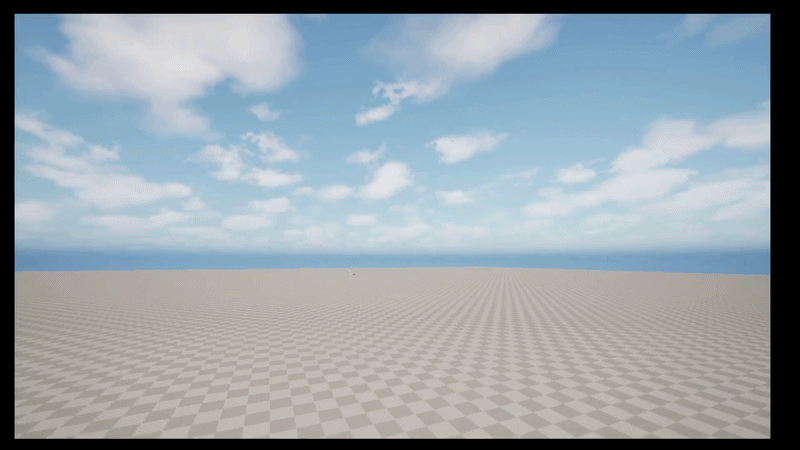

# Tool Ideation
Week 1 and 2
---

## 1. Introduction 
For this task, I prototyped an engine plugin in Unreal Engine 5.6.1, focusing on controller support. The goal was to create a lightweight system that allows players to navigate UI menus using a gamepad.

I chose this because UI navigation with both keyboard and controller input can become messy in Unreal, especially in UI-heavy projects. Developers often have to set this up manually, and it doesn’t always behave consistently. This system was designed for a PC game that will be released on Steam, so I also needed to consider how Unreal’s input system integrates with external platforms such as the Steam API. It makes use of the Enhanced Input system, including Input Mapping Contexts and related data.

The main aim was to create something reusable that could simplify controller-based UI navigation and improve the overall user experience. While I wasn’t able to complete the full plugin or implement advanced input remapping features, I did develop a working prototype that demonstrates the core concept.

---

## 2. Implementation 
The prototype was developed directly in Unreal Engine using Blueprints and the Enhanced Input system. Although the original plan was to package it as a standalone plugin, I implemented it within the project due to time constraints. (Enhanced Input in UE5 | Tutorial, 2022), (The easiest way of how to setup Xbox 360 controller on PC, s.d.)

_**Figure 1 and 2** shows the original inputs and imc that I implemented into into a test branch of the game._

The core of the system is managed by the PC_MainInstance Player Controller. It uses an enum (E Menu State) and a function called ApplyMenuState to control which UI elements are active and ensure the controller interacts with the menus correctly. (I was wondering how Widget Switchers work - Programming & Scripting / UI, 2015)

_**Figure 3** Shows a mermaid diagram of how the widget switcher that handles the pause menu works in a very simplifed format_

I created UI elements such as the pause menu (WBP_TestMenu) and the options menu (WBP_OptionsMenu), both designed for controller input. The pause menu was originally created as a test UI but was later developed into the main menu. By using focused widgets and switching input modes, players can navigate menus using a gamepad without needing a mouse. (how to set the focus on a widget - Programming & Scripting / UI, 2015)

_**Figure 4** This shows the focus I used on all my menus. I used this to focus on a button and this allows gamepad to register and work._

I also started developing an input remapping system, but this became more complex than expected due to changes in the Enhanced Input system in Unreal Engine 5.6.1. Integration with other systems caused conflicts with input bindings, making the controls menu unstable, so it was removed from the final build. (Unreal Engine 5.4 - Enhanced Input System Complete Remapping Menu, 2024)

_**Figure 5** This shows a very early verion of the gamepad remap system, while this doesnt appear to visually change throughout the project alot of the backend for it was changed and edited_

In addition, controller input works correctly inside Unreal, but does not always behave the same once the game is built, showing some limitations in how input is handled across different setups.

---

## 3. Outcome 

The final outcome was a working prototype for controller-based UI navigation in Unreal Engine. Players are able to open menus, move through different options, and interact with UI elements using a gamepad.

The main features I set out to implement, such as menu state management, input handling, and controller navigation through the UI, were successfully completed within Unreal’s input system. This shows that the core idea of the system works and that UI navigation can be handled in a more structured way.

Some planned features were not included in the final version. The input remapping system had to be removed due to technical issues and instability during development and testing. Because of this, the prototype is focused mainly on core menu navigation rather than full input customisation.

_**Figure 6** Shows the menu system working (I used gamepad solely in the recording). This video was made before the menu remapping._

_**Figure 7** Shows the early controls menu being tested. Here I am testing if I stopped a double mapping error that was happening._

If I were to continue developing this project, I would focus on finishing the input remapping system and refining the overall structure so it could be packaged into a reusable plugin.

---

## 4. Bibliography

- Enhanced Input in UE5 | Tutorial (2022) At: [https://dev.epicgames.com/community/learning/tutorials/eD13/unreal-engine-enhanced-input-in-ue5](https://dev.epicgames.com/community/learning/tutorials/eD13/unreal-engine-enhanced-input-in-ue5) (Accessed  22/04/2026).

- How to set the focus on a widget - Programming & Scripting / UI (2015) At: [https://forums.unrealengine.com/t/how-to-set-the-focus-on-a-widget/304225](https://forums.unrealengine.com/t/how-to-set-the-focus-on-a-widget/304225) (Accessed  22/04/2026).

-   I was wondering how Widget Switchers work - Programming & Scripting / UI (2015) At: [https://forums.unrealengine.com/t/i-was-wondering-how-widget-switchers-work/304307/3](https://forums.unrealengine.com/t/i-was-wondering-how-widget-switchers-work/304307/3) (Accessed  22/04/2026).

- The easiest way of how to setup Xbox 360 controller on PC (s.d.) At: [https://www.rewasd.com/blog/post/how-to-setup-xbox-360-controller-on-pc](https://www.rewasd.com/blog/post/how-to-setup-xbox-360-controller-on-pc) (Accessed  22/04/2026).

- Unreal Engine 5.4 - Enhanced Input System Complete Remapping Menu (2024) Directed by Émile. At: [https://www.youtube.com/watch?v=o-r6XmLhD8A](https://www.youtube.com/watch?v=o-r6XmLhD8A) (Accessed  22/04/2026).

---

## 5. AI Usage Declaration

Chatgbt 5.4 was used to help structre this writeup.

---

